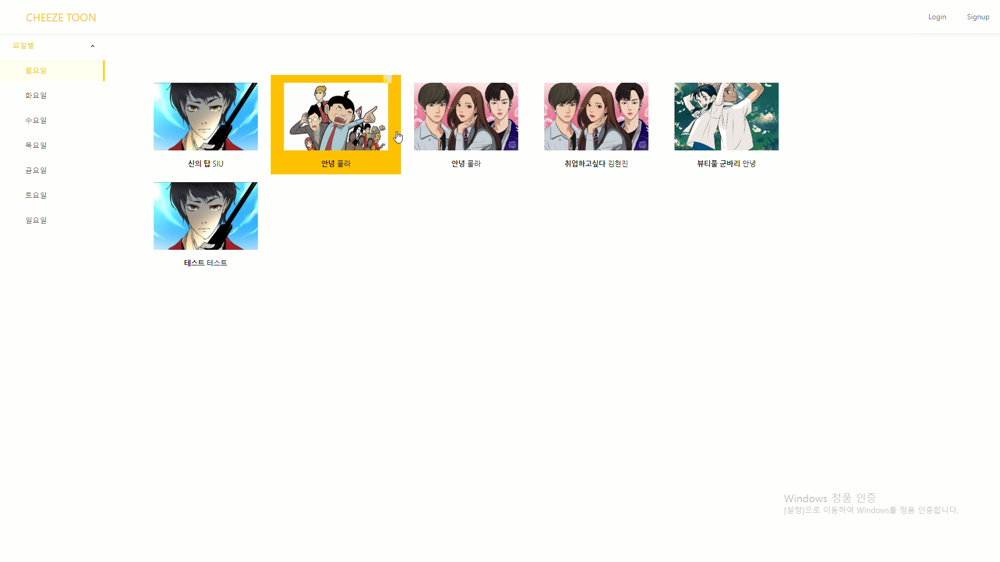
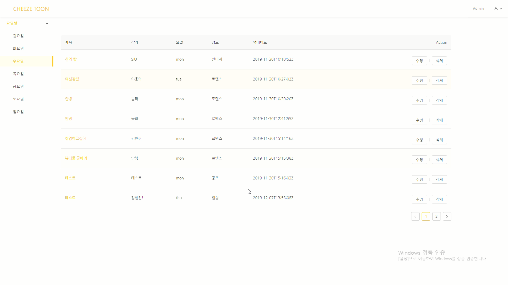
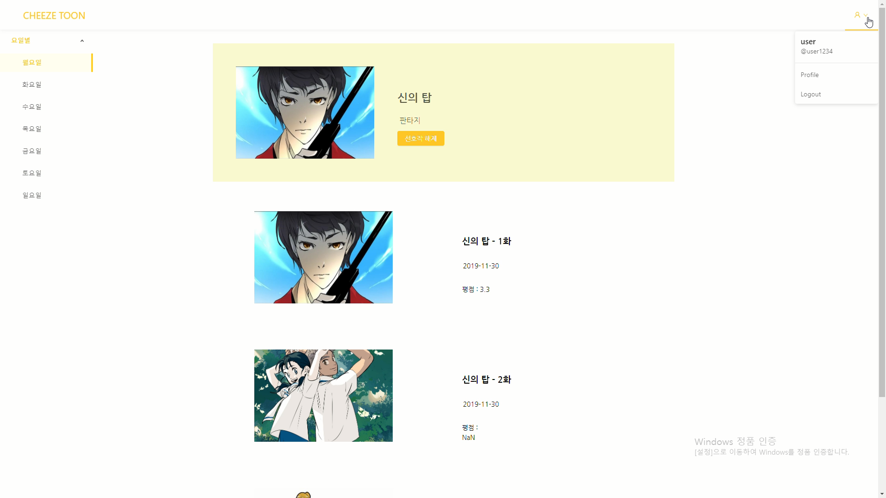

# 프로젝트 소개
Spring boot, React.js 프레임워크를 활용한 웹툰 홈페이지 "Cheeze Toon" 입니다.<br/>
풀스택 개발을 경험해보고자 진행한 프로젝트입니다.<br/>
"Cheeze Toon"이라는 타이틀은 제가 즐겨봤던 웹툰인 '치즈인터트랩'에서 따온 명입니다.

<br/>
<br/>

# 개발 인원
1명(개인 프로젝트)

<br/>
<br/>

# 개발 기간
2019.10.25~ 2019.12.03 (약 6주)

<br/>
<br/>

# 핵심 기능
- 로그인, 회원가입 기능(Spring security + JWT)
- 별점 등록, 수정, 별점 평균 출력
- 선호작품 등록, 삭제
- 댓글 등록, 수정, 삭제
- 요일별 웹툰 출력
- 관리자 로그인 시, 관리자 메뉴 노출
- 웹툰 등록(첨부파일 - Drag&Drop : React UI library Ant Design 활용), 수정, 삭제
- 웹툰 별 에피소드 등록, 수정, 삭제

<br/>
<br/>

# 개발 환경
- 개발환경 : Windows 10
- 개발도구 : vscode
- 구성환경 : Spring boot, Spring security, jwt, React.js, React-router, JPA, Hibernate, Mysql, Ant Design(React UI library)

<br/>
<br/>

# 실행 스크린 샷


메인 페이지 입니다.

<br/><br/>


관리자 페이지 입니다.

<br/><br/>


웹툰 홈화면 입니다.

<br/>
<br/>

# Steps to Setup the Spring Boot Back end app
<br/>

1. Clone the application

```
git clone https://github.com/doozi316/React-Spring-Cheezetoon.git
```
<br/>

2. 데이터 베이스 생성

```
create database cheezetoon
```
<br/>

3. Mysql 설정
<br/>
src/main/resources/application.properties 의 Mysql 설정을 수정하세요.

<br/>

4. Run the app

```
mvn spring-boot:run
```
<br/>

5. Default Roles 추가

```
INSERT IGNORE INTO roles(name) VALUES('ROLE_USER');
INSERT IGNORE INTO roles(name) VALUES('ROLE_ADMIN');
```
<Br/>
<br/>
<br/>

# Steps to Setup the React Front end app

<Br/>

1. frontend 디렉토리로 이동

```
cd frontend
```
<br/>

2. Run the app
```
npm install && npm start
```
